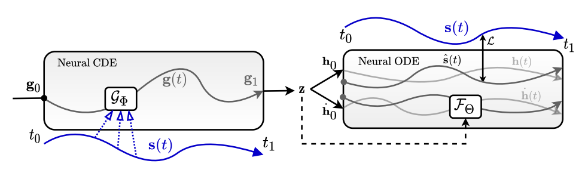
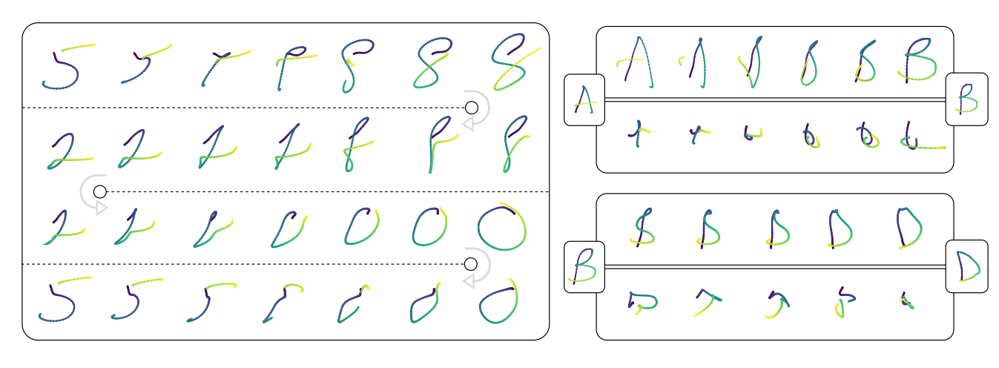

# SketchODE: Learning neural sketch representation in continuous time (Accepted at ICLR 2022)
### Authors: **[Ayan Das](https://ayandas.me/)**, Yongxin Yang, Timothy Hospedales, Tao Xiang, Yi-Zhe Song
#### Read the paper on [OpenReview](https://openreview.net/pdf?id=c-4HSDAWua5)



**Abstract:** Learning meaningful representations for chirographic drawing data such as sketches, handwriting, and flowcharts is a gateway for understanding and emulating human creative expression. Despite being inherently continuous-time data, existing works have treated these as discrete-time sequences, disregarding their true nature. In this work, we model such data as continuous-time functions and learn compact representations by virtue of Neural Ordinary Differential Equations. To this end, we introduce the first continuous-time Seq2Seq model and demonstrate some remarkable properties that set it apart from traditional discrete-time analogues. We also provide solutions for some practical challenges for such models, including introducing a family of parameterized ODE dynamics & continuous-time data augmentation particularly suitable for the task. Our models are validated on several datasets including VectorMNIST, DiDi and Quick, Draw!.

---

Some results cropped directly from the paper.



---

#### Some notes on the code:
1. This is my research repository. It may contain code that did not end up in the paper.
2. Few experiments are done in another codebase (can't be shared). But the core model is located in `model/` along with most of the experiments.
3. The original datasets need to be converted to a compatible format using the `utils/unpack_ndjson.py`.
4. `fit_ae_oneseq.py` is the training file. `infer_ae_oneseq.py` is the inference file.
5. Some older version of libraries are required. `torch == 1.9.0`, `pytorch-lightning == 1.4.2`, `torchdiffeq == 0.2.2`, `torchcde == 0.2.3`.
6. Default logger is `wandb`. You need to set it up for yourself.
7. The default HPs in the code might not match the paper's. See the paper for correct HPs.

---

#### Dataset:
The newly introduced `VectorMNIST` datasets is [located here](https://ayandas.me/sketchode). Any further update on the dataset will be reflected on the same page.

---

```
@inproceedings{
    das2022sketchode,
    title={Sketch{ODE}: Learning neural sketch representation in continuous time},
    author={Ayan Das and Yongxin Yang and Timothy Hospedales and Tao Xiang and Yi-Zhe Song},
    booktitle={International Conference on Learning Representations},
    year={2022},
    url={https://openreview.net/forum?id=c-4HSDAWua5}
}
```
